### About me

👋 Hi, I'm **Mohd Zaid** (@zaidkhan0997). I build software, craft fast web apps, and contribute to open-source Android & Linux kernel development.

- 🔭 Currently working on: *Full-Stack Apps, Android Custom ROMs & Linux Kernels*
- 🌱 Learning: *Advanced Distributed Systems & High Performance Architecture*
- 💬 Ask me about: *TypeScript, React, Python, Linux Kernel, AOSP, and Web Development*

### Stats

  
  

